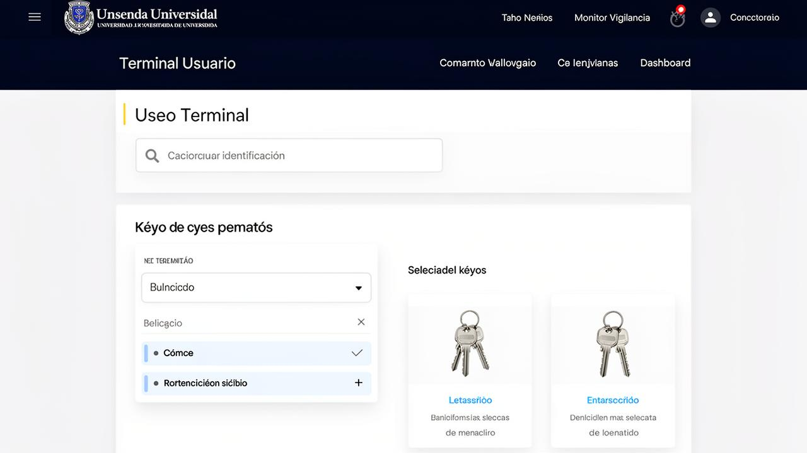
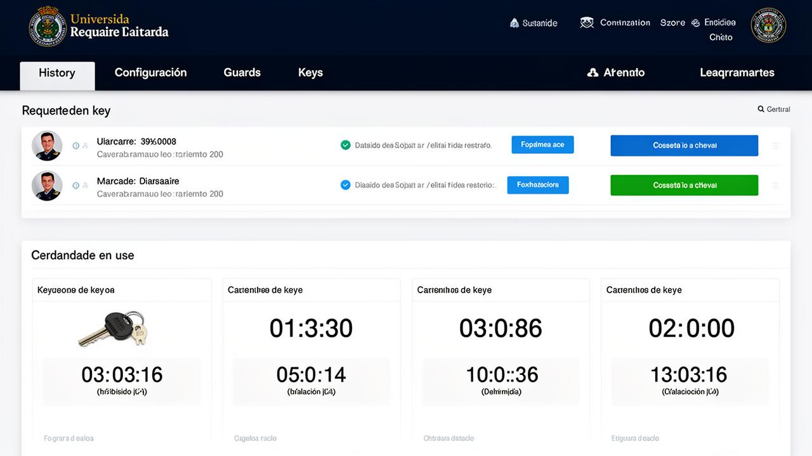
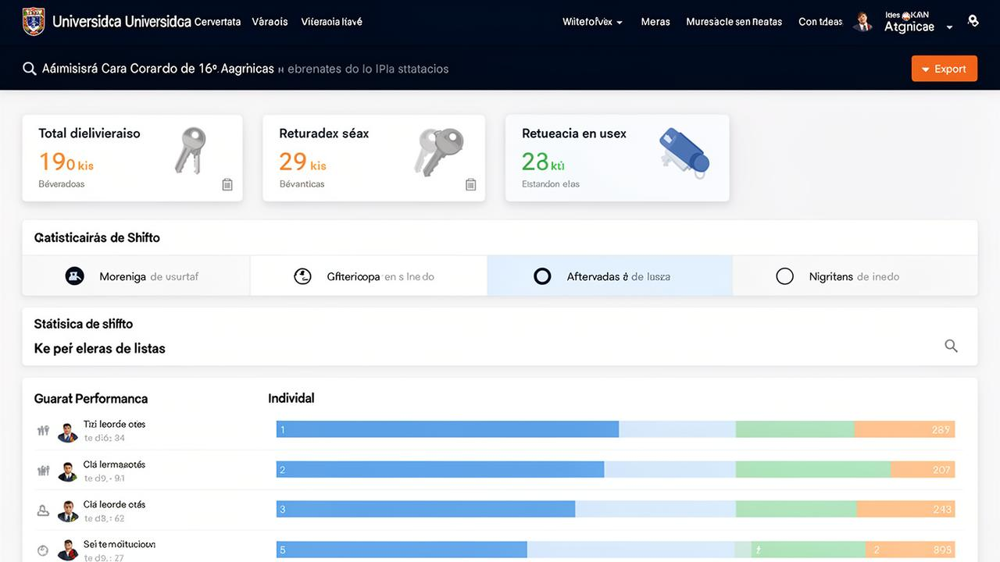
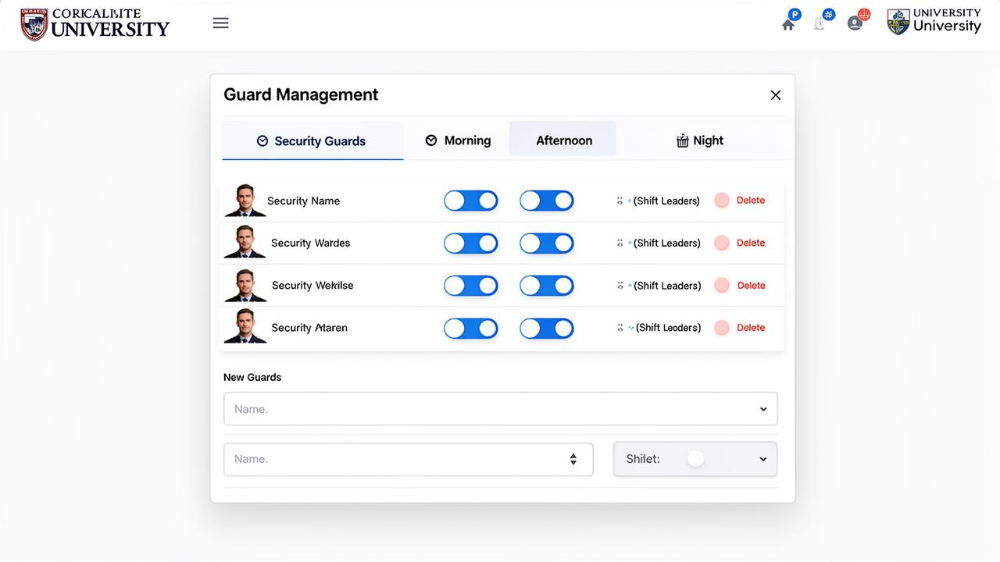
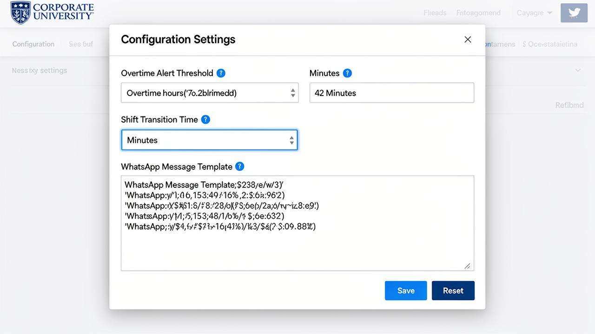
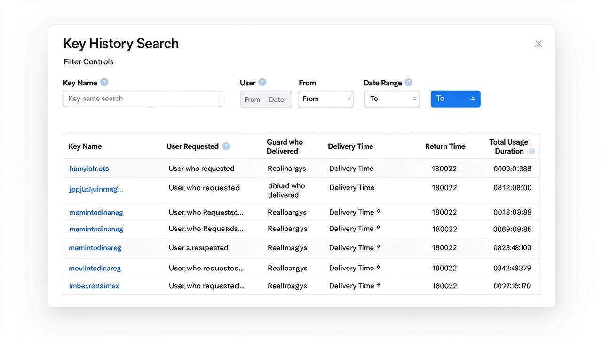

# Especificacion de Requisitos de Software (SRS)
## Sistema de Gestion de Llaves - FCEA UdelaR

**Version:** 4.0  
**Fecha:** Abril 2026  
**Elaborado por:** Equipo de Desarrollo  
**Institucion:** Facultad de Ciencias Economicas y de Administracion - Universidad de la Republica

---

## Tabla de Contenidos

1. [Introduccion](#1-introduccion)
   - 1.1 [Proposito](#11-proposito)
   - 1.2 [Alcance](#12-alcance)
   - 1.3 [Definiciones y Acronimos](#13-definiciones-y-acronimos)
   - 1.4 [Referencias](#14-referencias)
2. [Descripcion General](#2-descripcion-general)
   - 2.1 [Perspectiva del Producto](#21-perspectiva-del-producto)
   - 2.2 [Funciones del Producto](#22-funciones-del-producto)
   - 2.3 [Caracteristicas de los Usuarios](#23-caracteristicas-de-los-usuarios)
   - 2.4 [Restricciones](#24-restricciones)
   - 2.5 [Suposiciones y Dependencias](#25-suposiciones-y-dependencias)
3. [Requisitos Especificos](#3-requisitos-especificos)
   - 3.1 [Requisitos Funcionales](#31-requisitos-funcionales)
   - 3.2 [Requisitos No Funcionales](#32-requisitos-no-funcionales)
   - 3.3 [Requisitos de Interfaz](#33-requisitos-de-interfaz)
4. [Arquitectura del Sistema](#4-arquitectura-del-sistema)
   - 4.1 [Diagrama de Arquitectura](#41-diagrama-de-arquitectura)
   - 4.2 [Componentes del Sistema](#42-componentes-del-sistema)
   - 4.3 [Modelo de Datos](#43-modelo-de-datos)
5. [Casos de Uso](#5-casos-de-uso)
   - 5.1 [Diagrama General de Casos de Uso](#51-diagrama-general-de-casos-de-uso)
   - 5.2 [Especificacion de Casos de Uso](#52-especificacion-de-casos-de-uso)
6. [Diagramas de Flujo](#6-diagramas-de-flujo)
   - 6.1 [Flujo de Solicitud de Llave](#61-flujo-de-solicitud-de-llave)
   - 6.2 [Flujo de Entrega de Llave](#62-flujo-de-entrega-de-llave)
   - 6.3 [Flujo de Devolucion de Llave](#63-flujo-de-devolucion-de-llave)
   - 6.4 [Flujo de Alerta por Tiempo Excedido](#64-flujo-de-alerta-por-tiempo-excedido)
7. [Interfaces de Usuario](#7-interfaces-de-usuario)
   - 7.1 [Terminal de Usuario](#71-terminal-de-usuario)
   - 7.2 [Monitor de Vigilancia](#72-monitor-de-vigilancia)
   - 7.3 [Dashboard de Estadisticas](#73-dashboard-de-estadisticas)
8. [Capturas de Pantalla del Sistema](#8-capturas-de-pantalla-del-sistema)
   - 8.1 [Terminal de Usuario](#81-terminal-de-usuario)
   - 8.2 [Monitor de Vigilancia](#82-monitor-de-vigilancia)
   - 8.3 [Dashboard Estadistico](#83-dashboard-estadistico)
   - 8.4 [Modales de Configuracion](#84-modales-de-configuracion)
9. [Seguridad y Control de Acceso](#9-seguridad-y-control-de-acceso)
10. [Resilencia y Recuperación](#10-resilencia-y-recuperacion)
11. [Glosario](#11-glosario)
12. [Apendices](#12-apendices)

---

## 1. Introduccion

### 1.1 Proposito

El presente documento tiene como objetivo definir de manera integral los requisitos funcionales y no funcionales del **Sistema de Gestion de Llaves** para la Facultad de Ciencias Economicas y de Administracion (FCEA) de la Universidad de la Republica.

Este sistema busca modernizar y optimizar el proceso de prestamo, control y devolucion de llaves de los distintos espacios fisicos de la facultad (salones, oficinas, laboratorios, depositos), proporcionando trazabilidad completa, alertas automatizadas y reportes estadisticos para la toma de decisiones administrativas.

### 1.2 Alcance

El Sistema de Gestion de Llaves abarca:

- **Solicitud de llaves** por parte de docentes, estudiantes y personal administrativo
- **Gestion de entregas y devoluciones** por parte del personal de vigilancia
- **Control de tiempos de uso** con alertas automatizadas
- **Registro historico** de todas las operaciones
- **Generacion de reportes** para la administracion
- **Gestion de personal de vigilancia** por turnos
- **Respaldo automatizado** con retención de datos históricos de un año
- **Recuperación ante fallos** mediante sistema de pendrive de recuperación

**Limites del sistema:**
- No incluye control de acceso electronico (cerraduras inteligentes)
- No gestiona la seguridad fisica del edificio mas alla del control de llaves
- No incluye sistema de reservas anticipadas de espacios

### 1.3 Definiciones y Acronimos

| Termino | Definicion |
|---------|------------|
| FCEA | Facultad de Ciencias Economicas y de Administracion |
| UdelaR | Universidad de la Republica |
| SRS | Software Requirements Specification (Especificacion de Requisitos de Software) |
| Terminal | Punto de acceso donde los usuarios solicitan llaves |
| Monitor | Interfaz utilizada por el personal de vigilancia |
| Turno | Periodo de trabajo del personal de vigilancia (Matutino, Vespertino, Nocturno) |
| Llave | Elemento fisico que permite acceso a un espacio determinado |
| Tablero | Panel fisico donde se almacenan las llaves, organizado por filas y columnas |
| PocketBase | Motor de base de datos local integrado utilizado por el sistema |
| Zona | División física del tablero (Principal, Hibrido, Externo) |

### 1.4 Referencias

- Reglamento interno de uso de espacios fisicos - FCEA UdelaR
- Manual de procedimientos de vigilancia - FCEA
- Normativas de seguridad universitaria - UdelaR
- Manual de recuperación y reinstalación - FCEA

---

## 2. Descripcion General

### 2.1 Perspectiva del Producto

El Sistema de Gestion de Llaves es una aplicacion web responsiva que opera de forma independiente, diseñada para ser accedida desde multiples dispositivos simultaneamente. Se compone de tres modulos principales interconectados:

```
+------------------------------------------------------------------+
|                    SISTEMA DE GESTION DE LLAVES                   |
+------------------------------------------------------------------+
|                                                                   |
|  +------------------+  +------------------+  +------------------+ |
|  |                  |  |                  |  |                  | |
|  |    TERMINAL      |  |    MONITOR DE    |  |    DASHBOARD     | |
|  |    DE USUARIO    |  |    VIGILANCIA    |  |    ESTADISTICO   | |
|  |                  |  |                  |  |                  | |
|  +--------+---------+  +--------+---------+  +--------+---------+ |
|           |                     |                     |           |
|           +----------+----------+----------+----------+           |
|                      |                     |                      |
|              +-------v-------+     +-------v-------+              |
|              |   CONTEXTO    |     |  BASE DE DATOS |             |
|              |   COMPARTIDO  |     |  POCKETBASE    |             |
|              +---------------+     +----------------+              |
|                                                                   |
+------------------------------------------------------------------+
```

### 2.2 Funciones del Producto

Las funciones principales del sistema son:

1. **Gestion de Solicitudes**
   - Registro de solicitudes de llaves por usuarios
   - Cola de solicitudes pendientes en tiempo real
   - Busqueda y seleccion de llaves disponibles
   - Sistema de llaves frecuentes personalizado para cada usuario

2. **Control de Entregas y Devoluciones**
   - Registro de entrega con identificacion del vigilante responsable
   - Registro de devolucion con calculo automatico de tiempo de uso
   - Funcion de deshacer operaciones (ventana de 2 minutos)
   - Intercambio de llave entre usuarios

3. **Sistema de Alertas**
   - Notificacion visual cuando el tiempo de uso excede el limite configurado
   - Generacion automatica de mensaje WhatsApp para contactar al usuario
   - Alertas sonoras configurables para eventos importantes

4. **Gestion de Personal**
   - Administracion de vigilantes por turno
   - Transicion suave entre turnos (30 minutos configurable)
   - Designacion de jefes de turno
   - Control de acceso por rol

5. **Reportes y Estadisticas**
   - Dashboard con metricas en tiempo real
   - Historial de busqueda con filtros avanzados
   - Exportacion de reportes mensuales en formato CSV
   - Visualizaciones gráficas avanzadas

6. **Gestion de Inventario**
   - Administración de zonas del tablero (Principal, Híbrido, Externo)
   - Ubicación física con coordenadas (fila/columna)
   - Editores visuales para ubicación en tablero
   - Clasificación por tipo de espacio

7. **Recuperación ante Fallos**
   - Respaldos automáticos semanales (retención: 52 semanas)
   - Sistema de pendrive de recuperación completo
   - Detección y reconexión automática silenciosa
   - Repositorio de código en GitHub

### 2.3 Caracteristicas de los Usuarios

El sistema contempla tres tipos de usuarios con diferentes perfiles:

#### Usuario Solicitante
- **Perfil:** Docentes, estudiantes, personal administrativo, empresas externas
- **Conocimientos tecnicos:** Basicos (uso de navegador web)
- **Frecuencia de uso:** Variable (diaria a esporadica)
- **Necesidades:** Solicitar llaves de forma rapida y sencilla, acceso a llaves frecuentes

#### Vigilante
- **Perfil:** Personal de seguridad de la facultad
- **Conocimientos tecnicos:** Basicos a intermedios
- **Frecuencia de uso:** Continua durante su turno
- **Necesidades:** Gestionar entregas/devoluciones, ver solicitudes pendientes, ubicar llaves en tablero

#### Administrador/Intendencia
- **Perfil:** Personal administrativo de la facultad
- **Conocimientos tecnicos:** Intermedios
- **Frecuencia de uso:** Periodica (semanal/mensual)
- **Necesidades:** Acceso a reportes, estadisticas, configuracion del sistema

### 2.4 Restricciones

- **Tecnologicas:** El sistema debe funcionar en navegadores web modernos (Chrome, Firefox, Safari, Edge)
- **Operativas:** Debe operar 24/7 los 365 dias del año, incluso con conexión limitada
- **De conectividad:** Funciona en modo local con sincronización automática al restaurar conexión
- **De almacenamiento:** Utiliza PocketBase como base de datos embebida (SQLite) y sistema de respados

### 2.5 Suposiciones y Dependencias

**Suposiciones:**
- Los usuarios tienen acceso a dispositivos con navegador web
- El personal de vigilancia recibe capacitacion basica sobre el uso del sistema
- Las llaves fisicas estan correctamente identificadas y ubicadas en el tablero

**Dependencias:**
- Disponibilidad de hardware básico (PC con Windows 10/11)
- Mantenimiento del tablero fisico de llaves actualizado
- Coordinacion con el area de recursos humanos para actualizacion de turnos

---

## 3. Requisitos Especificos

### 3.1 Requisitos Funcionales

#### RF-001: Solicitud de Llaves
| Campo | Descripcion |
|-------|-------------|
| ID | RF-001 |
| Nombre | Solicitud de Llaves |
| Descripcion | El sistema debe permitir a los usuarios solicitar una o mas llaves simultaneamente |
| Prioridad | Alta |
| Entrada | Datos del usuario (nombre, celular, tipo), llaves seleccionadas |
| Salida | Confirmacion de solicitud, notificacion a vigilancia |
| Precondiciones | Usuario en terminal, llaves disponibles en el sistema |
| Postcondiciones | Solicitud agregada a la cola de pendientes |

#### RF-002: Busqueda de Llaves
| Campo | Descripcion |
|-------|-------------|
| ID | RF-002 |
| Nombre | Busqueda de Llaves |
| Descripcion | El sistema debe permitir buscar llaves por nombre, codigo o tipo de espacio |
| Prioridad | Alta |
| Entrada | Termino de busqueda |
| Salida | Lista filtrada de llaves que coinciden con el criterio |

#### RF-003: Entrega de Llave
| Campo | Descripcion |
|-------|-------------|
| ID | RF-003 |
| Nombre | Entrega de Llave |
| Descripcion | El vigilante debe poder registrar la entrega de una llave a un usuario |
| Prioridad | Alta |
| Entrada | ID de solicitud, vigilante que entrega |
| Salida | Registro de entrega con timestamp, inicio de contador de uso |
| Postcondiciones | Llave marcada como "en uso", registro de actividad creado |

#### RF-004: Devolucion de Llave
| Campo | Descripcion |
|-------|-------------|
| ID | RF-004 |
| Nombre | Devolucion de Llave |
| Descripcion | El vigilante debe poder registrar la devolucion de una llave |
| Prioridad | Alta |
| Entrada | ID de solicitud, vigilante que recibe |
| Salida | Registro de devolucion con calculo de tiempo total de uso |

#### RF-005: Funcion Deshacer
| Campo | Descripcion |
|-------|-------------|
| ID | RF-005 |
| Nombre | Funcion Deshacer |
| Descripcion | Permitir revertir una entrega o devolucion dentro de los 2 minutos siguientes |
| Prioridad | Media |
| Entrada | Accion de deshacer |
| Salida | Reversion del estado anterior |
| Restricciones | Solo disponible dentro de ventana de 2 minutos |

#### RF-006: Alerta por Tiempo Excedido
| Campo | Descripcion |
|-------|-------------|
| ID | RF-006 |
| Nombre | Alerta por Tiempo Excedido |
| Descripcion | Mostrar alerta visual cuando una llave excede el tiempo limite de uso |
| Prioridad | Alta |
| Entrada | Tiempo de uso actual, tiempo limite configurado |
| Salida | Indicador visual (punto rojo pulsante), boton de WhatsApp |
| Configuracion | Tiempo limite configurable (por defecto: 2h 15min) |

#### RF-007: Mensaje WhatsApp
| Campo | Descripcion |
|-------|-------------|
| ID | RF-007 |
| Nombre | Generacion de Mensaje WhatsApp |
| Descripcion | Generar enlace de WhatsApp con mensaje predefinido para contactar al usuario |
| Prioridad | Media |
| Entrada | Numero de celular del usuario, nombre de la llave |
| Salida | Enlace wa.me con mensaje codificado |
| Configuracion | Plantilla de mensaje editable |

#### RF-008: Gestion de Vigilantes
| Campo | Descripcion |
|-------|-------------|
| ID | RF-008 |
| Nombre | Gestion de Vigilantes |
| Descripcion | Administrar el registro de vigilantes asignados a cada turno |
| Prioridad | Alta |
| Operaciones | Agregar, editar, eliminar vigilantes; asignar turno; designar jefe de turno |

#### RF-009: Transicion de Turnos
| Campo | Descripcion |
|-------|-------------|
| ID | RF-009 |
| Nombre | Transicion de Turnos |
| Descripcion | Durante el periodo de transicion, mostrar vigilantes del turno anterior y actual |
| Prioridad | Media |
| Configuracion | Duracion de transicion configurable (por defecto: 30 minutos) |

#### RF-010: Busqueda en Historial
| Campo | Descripcion |
|-------|-------------|
| ID | RF-010 |
| Nombre | Busqueda en Historial |
| Descripcion | Permitir buscar en el historial de operaciones con filtros multiples |
| Prioridad | Alta |
| Filtros | Nombre de llave, usuario, vigilante, rango de fechas |
| Salida | Lista de operaciones con detalles completos |

#### RF-011: Exportacion de Reportes
| Campo | Descripcion |
|-------|-------------|
| ID | RF-011 |
| Nombre | Exportacion de Reportes Mensuales |
| Descripcion | Generar reportes en formato CSV con estadisticas mensuales |
| Prioridad | Alta |
| Contenido | Resumen general, estadisticas por turno, detalle por vigilante, log de operaciones |

#### RF-012: Dashboard Estadistico
| Campo | Descripcion |
|-------|-------------|
| ID | RF-012 |
| Nombre | Dashboard de Estadisticas |
| Descripcion | Visualizar metricas de operacion en tiempo real |
| Prioridad | Media |
| Metricas | Total entregas/devoluciones, por turno, por vigilante, actividad reciente |

#### RF-013: Gestion de Llaves
| Campo | Descripcion |
|-------|-------------|
| ID | RF-013 |
| Nombre | Gestion de Catalogo de Llaves |
| Descripcion | Administrar el catalogo de llaves disponibles en el sistema |
| Prioridad | Alta |
| Operaciones | Agregar nueva llave, eliminar llave, configurar ubicacion en tablero |

#### RF-014: Intercambio de Llave
| Campo | Descripcion |
|-------|-------------|
| ID | RF-014 |
| Nombre | Intercambio de Llave |
| Descripcion | Permitir transferir una llave de un usuario a otro sin devolverla primero |
| Prioridad | Media |
| Entrada | ID de solicitud activa, datos nuevo usuario, vigilante que gestiona |
| Salida | Registro de usuario anterior y nuevo, manteniendo historial |

#### RF-015: Alerta Sonora
| Campo | Descripcion |
|-------|-------------|
| ID | RF-015 |
| Nombre | Alerta Sonora |
| Descripcion | Reproducir sonidos configurables para eventos importantes |
| Prioridad | Baja |
| Eventos | Nueva solicitud, tiempo excedido, devolución completada |
| Configuracion | Volumen y tipo de sonido personalizables, opción de silenciar |

#### RF-016: Gestion de Zonas del Tablero
| Campo | Descripcion |
|-------|-------------|
| ID | RF-016 |
| Nombre | Gestion de Zonas del Tablero |
| Descripcion | Administrar diferentes zonas físicas donde se almacenan las llaves |
| Prioridad | Media |
| Operaciones | Configurar zonas (Principal, Híbrido, Externo), asignar llaves a zonas |

#### RF-017: Respaldo Automático
| Campo | Descripcion |
|-------|-------------|
| ID | RF-017 |
| Nombre | Respaldo Automático |
| Descripcion | Crear copias de seguridad periódicas de la base de datos |
| Prioridad | Alta |
| Frecuencia | Semanal (domingos) |
| Retención | 52 semanas (1 año) |
| Formato | Compresión ZIP de base de datos PocketBase |

#### RF-018: Registro de Objetos Olvidados
| Campo | Descripcion |
|-------|-------------|
| ID | RF-018 |
| Nombre | Registro de Objetos Olvidados |
| Descripcion | Permitir registrar objetos olvidados en espacios de la facultad |
| Prioridad | Baja |
| Entrada | Descripción del objeto, ubicación, fecha, encargado |
| Salida | Lista de objetos pendientes de reclamar |

### 3.2 Requisitos No Funcionales

#### RNF-001: Rendimiento
- El sistema debe responder a cualquier accion del usuario en menos de 2 segundos
- La actualizacion de la cola de solicitudes debe ser en tiempo real (< 500ms)

#### RNF-002: Disponibilidad
- El sistema debe estar disponible 24/7 con un uptime minimo del 99%
- Capacidad de seguir operando en modo offline con reconexión automática silenciosa
- Las caidas programadas para mantenimiento no deben exceder 1 hora mensual

#### RNF-003: Usabilidad
- La interfaz debe ser intuitiva y no requerir capacitacion extensa
- Los textos deben ser legibles a distancia de 1 metro (para uso en cabina de vigilancia)
- El sistema debe ser accesible desde dispositivos moviles (responsive design)
- Interfaz con mensaje de bienvenida y créditos a sección Vigilancia FCEA

#### RNF-004: Compatibilidad
- Compatible con Chrome 90+, Firefox 88+, Safari 14+, Edge 90+
- Funcional en dispositivos con resolucion minima de 320px de ancho
- Compatible con pantallas táctiles

#### RNF-005: Escalabilidad
- Debe soportar al menos 100 llaves en el catalogo
- Debe manejar al menos 500 operaciones diarias sin degradacion
- Escalable a múltiples tipos de edificios y zonas

#### RNF-006: Mantenibilidad
- El codigo debe estar documentado y seguir estandares de desarrollo
- Los componentes deben ser modulares para facilitar actualizaciones
- Métodos de recuperación establecidos y probados regularmente

#### RNF-007: Resiliencia
- Capacidad de recuperación tras fallos mediante script de pendrive
- Restauración completa posible en menos de 15 minutos
- Reinicio automático tras cortes de energía

### 3.3 Requisitos de Interfaz

#### RI-001: Interfaz de Usuario
- Diseño limpio con paleta de colores institucional
- Uso de iconografia clara y reconocible
- Feedback visual para todas las acciones del usuario
- Modo oscuro disponible
- Mensajes de bienvenida y créditos en terminal usuario

#### RI-002: Interfaz de Datos
- Almacenamiento en base de datos PocketBase (SQLite)
- Respaldo automático semanal con retención de un año
- Formato de exportación: CSV compatible con Excel

---

## 4. Arquitectura del Sistema

### 4.1 Diagrama de Arquitectura

```
+------------------------------------------------------------------+
|                         CAPA DE PRESENTACION                      |
+------------------------------------------------------------------+
|                                                                   |
|   +-----------------+  +-----------------+  +-----------------+   |
|   |   Terminal de   |  |   Monitor de    |  |   Dashboard     |   |
|   |     Usuario     |  |   Vigilancia    |  |  Estadistico    |   |
|   |  (/terminal)    |  |   (/monitor)    |  |  (/dashboard)   |   |
|   +-----------------+  +-----------------+  +-----------------+   |
|           |                    |                    |             |
+-----------+--------------------+--------------------+-------------+
            |                    |                    |
+-----------v--------------------v--------------------v-------------+
|                         CAPA DE COMPONENTES                       |
+------------------------------------------------------------------+
|                                                                   |
|   +------------------+  +------------------+  +------------------+ |
|   | Componentes de   |  | Componentes de   |  | Componentes de  | |
|   | Formularios      |  | Visualizacion    |  | Modales         | |
|   +------------------+  +------------------+  +------------------+ |
|                                                                   |
+------------------------------------------------------------------+
            |                    |                    |
+-----------v--------------------v--------------------v-------------+
|                         CAPA DE LOGICA                            |
+------------------------------------------------------------------+
|                                                                   |
|   +------------------+  +------------------+  +------------------+ |
|   | useSolicitudes   |  | useVigilantes    |  | useConfiguracion| |
|   | Context          |  | Hook             |  | Hook            | |
|   +------------------+  +------------------+  +------------------+ |
|                                                                   |
|   +------------------+  +------------------+  +------------------+ |
|   | useBusqueda      |  | useHistorial     |  | exportUtils     | |
|   | Historial        |  | Llaves           |  |                 | |
|   +------------------+  +------------------+  +------------------+ |
|                                                                   |
+------------------------------------------------------------------+
            |                    |                    |
+-----------v--------------------v--------------------v-------------+
|                         CAPA DE DATOS                             |
+------------------------------------------------------------------+
|                                                                   |
|   +------------------+  +------------------+  +------------------+ |
|   | PocketBase       |  | Tipos TypeScript |  | Datos Iniciales | |
|   | (persistencia)   |  | (interfaces)     |  | (fceaData)      | |
|   +------------------+  +------------------+  +------------------+ |
|                                                                   |
+------------------------------------------------------------------+
```

### 4.2 Componentes del Sistema

#### Modulo Terminal de Usuario
```
TerminalUsuario/
|-- TerminalHeader.tsx       # Encabezado con hora y mensaje bienvenida
|-- UserSearchInput.tsx      # Registro de datos del usuario
|-- KeySearch.tsx            # Busqueda de llaves
|-- FrequentKeys.tsx         # Acceso rapido a llaves frecuentes
|-- RegistrationModal.tsx    # Modal de confirmacion de registro
|-- RequestConfirmation.tsx  # Confirmacion de solicitud
|-- RequestSuccess.tsx       # Mensaje de exito
|-- ExchangeConfirmation.tsx # Modal de intercambio de llave
```

#### Modulo Monitor de Vigilancia
```
MonitorVigilancia/
|-- MonitorHeader.tsx        # Encabezado con contadores
|-- PendingRequestCard.tsx   # Tarjeta de solicitud pendiente
|-- KeyInUseCard.tsx         # Tarjeta de llave en uso
|-- BoardLocation.tsx        # Ubicacion en tablero fisico
|-- KeyManagementModal.tsx   # Gestion de catalogo de llaves
|-- GuardManagementModal.tsx # Gestion de vigilantes
|-- ConfigurationModal.tsx   # Configuracion del sistema
|-- KeyHistorySearch.tsx     # Busqueda en historial
|-- SoundControls.tsx        # Control de alertas sonoras
|-- ObjetosOlvidadosModal.tsx # Registro de objetos olvidados
|-- AgendaModal.tsx          # Anotador de eventos diarios
|-- AutorizacionesTab.tsx    # Gestión de permisos especiales
```

#### Modulo Dashboard
```
Dashboard/
|-- Dashboard.tsx            # Vista principal de estadisticas
|-- ExportReportModal.tsx    # Modal de exportacion
|-- TurnStatsPieCharts.tsx   # Gráficos circulares por turno
|-- AdvancedChartVisualizations.tsx # Visualizaciones avanzadas
|-- AdvancedExportModal.tsx  # Exportación personalizada
```

### 4.3 Modelo de Datos

#### Entidades Principales

```
+------------------+       +------------------+       +------------------+
|     Lugar        |       |  SolicitudLlave  |       |    Vigilante     |
+------------------+       +------------------+       +------------------+
| id: string       |       | id: string       |       | id: string       |
| nombre: string   |<------| lugar: Lugar     |       | nombre: string   |
| tipo: TipoLugar  |       | usuario: Usuario |------>| turno: Turno     |
| disponible: bool |       | terminal: string |       | esJefe: boolean  |
| edificio: string |       | horaSolicitud    |       +------------------+
| tablero: Tablero |       | horaEntrega?     |
| esHibrido: bool  |       | horaDevolucion?  |
| ubicacion:       |       | entregadoPor?    |
|   zona: Zona     |       | recibidoPor?     |
|   fila: string   |       | estado: Estado   |
|   columna: number|       | esIntercambio    |
+------------------+       | usuarioAnterior? |
                           +------------------+
                                   |
                                   v
+------------------+       +------------------+
| RegistroActividad|       |   AccionUndo     |
+------------------+       +------------------+
| id: string       |       | id: string       |
| solicitudId      |       | solicitudId      |
| tipo: TipoAccion |       | tipo: TipoAccion |
| vigilante: string|       | vigilante: string|
| turno: Turno     |       | timestamp: Date  |
| timestamp: Date  |       | expiresAt: Date  |
| lugarNombre      |       +------------------+
| usuarioNombre    |
+------------------+

+------------------+       +------------------+
|  Configuracion   |       |  ObjetoOlvidado  |
+------------------+       +------------------+
| tiempoAlertaMin  |       | id: string       |
| transicionMin    |       | descripcion      |
| mensajeWhatsApp  |       | ubicacion        |
| volumenAlertas   |       | fechaEncontrado  |
| sonidosHabilitados       | registradoPor    |
+------------------+       | estado           |
                           +------------------+
```

#### Enumeraciones

```typescript
// Tipos de Lugar
type TipoLugar = 'Salón' | 'Oficina' | 'Laboratorio' | 'Depósito' | 'Otro';

// Tipos de Usuario
type TipoUsuario = 'Docente' | 'Estudiante' | 'Administrativo' | 'Externo' | 'Personal TAS' | 'Empresa';

// Estados de Solicitud
type EstadoSolicitud = 'pendiente' | 'entregada' | 'devuelta';

// Turnos de Vigilancia
type Turno = 'Matutino' | 'Vespertino' | 'Nocturno';

// Tipos de Accion
type TipoAccion = 'entrega' | 'devolucion' | 'intercambio';

// Zonas del Tablero
type Zona = 'Fondo' | 'Principal' | 'Híbrido' | 'Externo';

// Ubicaciones de Tablero
type Tablero = 'Tablero Principal' | 'Tablero Híbrido' | 'Tablero Externo';
```

---

## 5. Casos de Uso

### 5.1 Diagrama General de Casos de Uso

```
+------------------------------------------------------------------+
|                    SISTEMA DE GESTION DE LLAVES                   |
+------------------------------------------------------------------+
|                                                                   |
|                         +------------------+                      |
|                         |    Solicitar     |                      |
|     +--------+          |     Llave        |                      |
|     |Usuario |--------->+------------------+                      |
|     |Solic.  |                                                    |
|     +--------+          +------------------+                      |
|         |               |    Buscar        |                      |
|         +-------------->|    Llave         |                      |
|                         +------------------+                      |
|         |                                                         |
|         +--------------+------------------+                       |
|                        |    Intercambiar  |                       |
|                        |     Llave        |                       |
|                        +------------------+                       |
|                                                                   |
|     +--------+          +------------------+                      |
|     |        |--------->|  Entregar Llave  |                      |
|     |        |          +------------------+                      |
|     |        |                                                    |
|     |        |          +------------------+                      |
|     |        |--------->|  Devolver Llave  |                      |
|     |Vigilante          +------------------+                      |
|     |        |                                                    |
|     |        |          +------------------+                      |
|     |        |--------->|  Deshacer Accion |                      |
|     |        |          +------------------+                      |
|     |        |                                                    |
|     |        |          +------------------+                      |
|     |        |--------->| Enviar WhatsApp  |                      |
|     +--------+          +------------------+                      |
|                                                                   |
|     +--------+          +------------------+                      |
|     |        |--------->| Gestionar        |                      |
|     |        |          | Vigilantes       |                      |
|     |        |          +------------------+                      |
|     |        |                                                    |
|     |Admin   |          +------------------+                      |
|     |        |--------->| Configurar       |                      |
|     |        |          | Sistema          |                      |
|     |        |          +------------------+                      |
|     |        |                                                    |
|     |        |          +------------------+                      |
|     |        |--------->| Exportar         |                      |
|     |        |          | Reportes         |                      |
|     |        |          +------------------+                      |
|     |        |                                                    |
|     |        |          +------------------+                      |
|     |        |--------->| Buscar en        |                      |
|     +--------+          | Historial        |                      |
|                         +------------------+                      |
|                                                                   |
+------------------------------------------------------------------+
```

### 5.2 Especificacion de Casos de Uso

#### CU-001: Solicitar Llave

| Campo | Descripcion |
|-------|-------------|
| **ID** | CU-001 |
| **Nombre** | Solicitar Llave |
| **Actor Principal** | Usuario Solicitante |
| **Descripcion** | El usuario solicita una o mas llaves desde el terminal |
| **Precondiciones** | El usuario se encuentra en el terminal de autoservicio |
| **Flujo Principal** | 1. El usuario ingresa su nombre y numero de celular<br>2. El usuario selecciona su tipo (Docente/Estudiante/Administrativo)<br>3. El usuario busca la llave deseada<br>4. El usuario selecciona una o mas llaves<br>5. El sistema muestra confirmacion<br>6. El usuario confirma la solicitud<br>7. El sistema registra la solicitud y notifica a vigilancia |
| **Flujo Alternativo** | 3a. El usuario selecciona una llave de la lista de frecuentes |
| **Postcondiciones** | La solicitud aparece en el monitor de vigilancia |

#### CU-002: Entregar Llave

| Campo | Descripcion |
|-------|-------------|
| **ID** | CU-002 |
| **Nombre** | Entregar Llave |
| **Actor Principal** | Vigilante |
| **Descripcion** | El vigilante entrega fisicamente la llave y registra la operacion |
| **Precondiciones** | Existe una solicitud pendiente en el sistema |
| **Flujo Principal** | 1. El vigilante visualiza la solicitud pendiente<br>2. El vigilante verifica la identidad del solicitante<br>3. El vigilante localiza la llave en el tablero (usando las coordenadas mostradas)<br>4. El vigilante presiona el boton con su nombre<br>5. El sistema registra la entrega y mueve la solicitud a "En Uso" |
| **Postcondiciones** | La llave aparece en la seccion "Llaves en Uso" con contador de tiempo |

#### CU-003: Devolver Llave

| Campo | Descripcion |
|-------|-------------|
| **ID** | CU-003 |
| **Nombre** | Devolver Llave |
| **Actor Principal** | Vigilante |
| **Descripcion** | El vigilante recibe la llave y registra la devolucion |
| **Precondiciones** | La llave esta marcada como "En Uso" |
| **Flujo Principal** | 1. El vigilante recibe la llave fisica<br>2. El vigilante localiza la tarjeta correspondiente en el monitor<br>3. El vigilante presiona el boton con su nombre para recibir<br>4. El sistema registra la devolucion con tiempo total de uso<br>5. El vigilante ubica la llave en el tablero segun las coordenadas |
| **Postcondiciones** | La llave se remueve de "En Uso", se genera registro historico |

#### CU-004: Intercambiar Llave

| Campo | Descripcion |
|-------|-------------|
| **ID** | CU-004 |
| **Nombre** | Intercambiar Llave |
| **Actor Principal** | Usuario Solicitante + Vigilante |
| **Descripcion** | Transferir una llave de un usuario a otro sin devolverla primero |
| **Precondiciones** | Existe una llave en estado "En Uso" |
| **Flujo Principal** | 1. El nuevo usuario solicita la llave ya en uso<br>2. El vigilante selecciona la opción "Intercambiar"<br>3. El vigilante registra los datos del nuevo usuario<br>4. El sistema registra el intercambio manteniendo el historial original<br>5. El sistema marca la solicitud como "intercambio" |
| **Postcondiciones** | La llave continúa en estado "En Uso" pero con nuevo usuario |

#### CU-005: Deshacer Operacion

| Campo | Descripcion |
|-------|-------------|
| **ID** | CU-005 |
| **Nombre** | Deshacer Operacion |
| **Actor Principal** | Vigilante |
| **Descripcion** | Revertir una entrega o devolucion erronea |
| **Precondiciones** | Operacion realizada hace menos de 2 minutos |
| **Flujo Principal** | 1. El vigilante identifica el error<br>2. El vigilante presiona el boton "Deshacer" (visible durante 2 minutos)<br>3. El sistema revierte la operacion al estado anterior |
| **Flujo Alternativo** | 2a. Si pasaron mas de 2 minutos, el boton no esta disponible |
| **Postcondiciones** | El estado de la solicitud vuelve al anterior |

#### CU-006: Gestionar Vigilantes

| Campo | Descripcion |
|-------|-------------|
| **ID** | CU-006 |
| **Nombre** | Gestionar Vigilantes |
| **Actor Principal** | Administrador |
| **Descripcion** | Agregar, editar o eliminar vigilantes del sistema |
| **Flujo Principal** | 1. El administrador accede al modal de gestion de vigilantes<br>2. El administrador selecciona la accion deseada (agregar/editar/eliminar)<br>3. El administrador completa los datos requeridos<br>4. El sistema actualiza el registro de vigilantes |
| **Postcondiciones** | La lista de vigilantes se actualiza en todo el sistema |

#### CU-007: Exportar Reporte

| Campo | Descripcion |
|-------|-------------|
| **ID** | CU-007 |
| **Nombre** | Exportar Reporte |
| **Actor Principal** | Administrador |
| **Descripcion** | Generar archivo CSV con estadisticas del mes |
| **Flujo Principal** | 1. El administrador accede al Dashboard<br>2. El administrador presiona "Exportar"<br>3. El administrador selecciona mes y año<br>4. El sistema genera el archivo CSV<br>5. El navegador descarga el archivo |
| **Postcondiciones** | Archivo CSV disponible en el dispositivo del usuario |

#### CU-008: Resetear Sistema

| Campo | Descripcion |
|-------|-------------|
| **ID** | CU-008 |
| **Nombre** | Resetear Sistema |
| **Actor Principal** | Administrador del Sistema |
| **Descripcion** | Reinstalar completamente el sistema tras un fallo crítico |
| **Precondiciones** | Pendrive de recuperación preparado previamente |
| **Flujo Principal** | 1. El administrador conecta el pendrive de recuperación<br>2. Ejecuta el script RESTAURAR_SISTEMA.bat<br>3. El script verifica la existencia de Node.js<br>4. El script respalda datos existentes (si los hay)<br>5. El script copia todos los archivos del sistema<br>6. El script restaura la base de datos desde el pendrive<br>7. El script inicia el sistema automáticamente |
| **Postcondiciones** | Sistema completamente funcional con todos los datos restaurados |

---

## 6. Diagramas de Flujo

### 6.1 Flujo de Solicitud de Llave

```
                              +-------------+
                              |   INICIO    |
                              +------+------+
                                     |
                                     v
                        +------------------------+
                        | Usuario accede a       |
                        | Terminal (/terminal)   |
                        +------------------------+
                                     |
                                     v
                        +------------------------+
                        | Ingresa nombre y       |
                        | numero de celular      |
                        +------------------------+
                                     |
                                     v
                        +------------------------+
                        | Selecciona tipo de     |
                        | usuario                |
                        +------------------------+
                                     |
                                     v
                   +----------------------------------+
                   | ¿Conoce el nombre de la llave?   |
                   +----------------------------------+
                          |                |
                         SI               NO
                          |                |
                          v                v
              +-----------------+  +-----------------+
              | Buscar por      |  | Ver llaves      |
              | nombre          |  | frecuentes      |
              +-----------------+  +-----------------+
                          |                |
                          +-------+--------+
                                  |
                                  v
                        +------------------------+
                        | Seleccionar llave(s)   |
                        | deseada(s)             |
                        +------------------------+
                                     |
                                     v
                   +----------------------------------+
                   | ¿Solicitar mas llaves?          |
                   +----------------------------------+
                          |                |
                         SI               NO
                          |                |
                          |                v
                          |     +------------------------+
                          |     | Confirmar seleccion    |
                          +---->+------------------------+
                                     |
                                     v
                        +------------------------+
                        | Sistema genera         |
                        | solicitud(es)          |
                        +------------------------+
                                     |
                                     v
                        +------------------------+
                        | Notificacion enviada   |
                        | a Monitor Vigilancia   |
                        +------------------------+
                                     |
                                     v
                        +------------------------+
                        | Mostrar confirmacion   |
                        | al usuario             |
                        +------------------------+
                                     |
                                     v
                              +-------------+
                              |     FIN     |
                              +-------------+
```

### 6.2 Flujo de Entrega de Llave

```
                              +-------------+
                              |   INICIO    |
                              +------+------+
                                     |
                                     v
                        +------------------------+
                        | Solicitud aparece en   |
                        | Cola de Pendientes     |
                        +------------------------+
                                     |
                                     v
                        +------------------------+
                        | Vigilante visualiza    |
                        | datos del solicitante  |
                        +------------------------+
                                     |
                                     v
                        +------------------------+
                        | Verificar identidad    |
                        | del solicitante        |
                        +------------------------+
                                     |
                                     v
                   +----------------------------------+
                   | ¿Identidad verificada?          |
                   +----------------------------------+
                          |                |
                         SI               NO
                          |                |
                          v                v
              +-----------------+  +-----------------+
              | Continuar       |  | Rechazar        |
              | proceso         |  | solicitud       |
              +-----------------+  +-----------------+
                          |                |
                          v                v
              +-----------------+       +------+
              | Ver ubicacion   |       | FIN  |
              | en tablero      |       +------+
              | (Fila/Columna)  |
              +-----------------+
                          |
                          v
              +-----------------+
              | Tomar llave     |
              | fisica          |
              +-----------------+
                          |
                          v
              +-----------------+
              | Presionar boton |
              | del vigilante   |
              +-----------------+
                          |
                          v
              +-----------------+
              | Sistema registra|
              | entrega         |
              +-----------------+
                          |
                          v
              +-----------------+
              | Inicia contador |
              | de tiempo de uso|
              +-----------------+
                          |
                          v
              +-----------------+
              | Opcion Deshacer |
              | disponible 2min |
              +-----------------+
                          |
                          v
                    +-------------+
                    |     FIN     |
                    +-------------+
```

### 6.3 Flujo de Devolucion de Llave

```
                              +-------------+
                              |   INICIO    |
                              +------+------+
                                     |
                                     v
                        +------------------------+
                        | Usuario entrega llave  |
                        | fisica al vigilante    |
                        +------------------------+
                                     |
                                     v
                        +------------------------+
                        | Vigilante localiza     |
                        | tarjeta en "En Uso"    |
                        +------------------------+
                                     |
                                     v
                        +------------------------+
                        | Verificar que la llave |
                        | corresponde a tarjeta  |
                        +------------------------+
                                     |
                                     v
                        +------------------------+
                        | Presionar boton del    |
                        | vigilante que recibe   |
                        +------------------------+
                                     |
                                     v
                        +------------------------+
                        | Sistema calcula tiempo |
                        | total de uso           |
                        +------------------------+
                                     |
                                     v
                        +------------------------+
                        | Sistema registra       |
                        | devolucion             |
                        +------------------------+
                                     |
                                     v
                        +------------------------+
                        | Ver ubicacion en       |
                        | tablero para guardar   |
                        +------------------------+
                                     |
                                     v
                        +------------------------+
                        | Vigilante guarda llave |
                        | en posicion correcta   |
                        +------------------------+
                                     |
                                     v
                              +-------------+
                              |     FIN     |
                              +-------------+
```

### 6.4 Flujo de Alerta por Tiempo Excedido

```
                              +-------------+
                              |   INICIO    |
                              +------+------+
                                     |
                                     v
                        +------------------------+
                        | Llave en estado        |
                        | "En Uso"               |
                        +------------------------+
                                     |
                                     v
                        +------------------------+
                        | Contador de tiempo     |
                        | activo                 |
                        +------------------------+
                                     |
                                     v
                   +----------------------------------+
                   | ¿Tiempo >= Limite configurado?  |
                   | (por defecto 2h 15min)          |
                   +----------------------------------+
                          |                |
                         NO               SI
                          |                |
                          v                v
              +-----------------+  +-----------------+
              | Continuar       |  | Activar alerta  |
              | monitoreando    |  | visual (punto   |
              |                 |  | rojo pulsante)  |
              +-----------------+  +-----------------+
                          |                |
                          |                v
                          |     +-----------------+
                          |     | Mostrar boton   |
                          |     | "Enviar WhatsApp"|
                          |     +-----------------+
                          |                |
                          |                v
                          |  +----------------------------------+
                          |  | ¿Vigilante presiona WhatsApp?   |
                          |  +----------------------------------+
                          |         |                |
                          |        NO               SI
                          |         |                |
                          |         v                v
                          |  +-----------+  +-----------------+
                          |  | Mantener  |  | Generar enlace  |
                          |  | alerta    |  | wa.me con       |
                          |  | visible   |  | mensaje         |
                          |  +-----------+  +-----------------+
                          |         |                |
                          |         |                v
                          |         |     +-----------------+
                          |         |     | Abrir WhatsApp  |
                          |         |     | en nueva pestaña|
                          |         |     +-----------------+
                          |         |                |
                          +----+----+----------------+
                               |
                               v
                   +----------------------------------+
                   | ¿Usuario devolvio la llave?     |
                   +----------------------------------+
                          |                |
                         NO               SI
                          |                |
                          |                v
                          |     +-----------------+
                          |     | Proceso de      |
                          |     | devolucion      |
                          |     +-----------------+
                          |                |
                          +-------+--------+
                                  |
                                  v
                            +-------------+
                            |     FIN     |
                            +-------------+
```

---

## 7. Interfaces de Usuario

### 7.1 Terminal de Usuario

El Terminal de Usuario es la interfaz publica donde los docentes, estudiantes y personal administrativo solicitan las llaves.

#### Componentes de la Interfaz

```
+------------------------------------------------------------------+
|  [Logo FCEA]        TERMINAL DE LLAVES           [Hora: 14:35]   |
|  ¡BIENVENIDOS!                                                    |
|  Software realizado 100% por Sección Vigilancia FCEA             |
+------------------------------------------------------------------+
|                                                                   |
|  +------------------------------------------------------------+  |
|  |                    REGISTRO DE USUARIO                      |  |
|  +------------------------------------------------------------+  |
|  |                                                             |  |
|  |  Nombre completo: [________________________]                |  |
|  |                                                             |  |
|  |  Celular:         [________________________]                |  |
|  |                                                             |  |
|  |  Tipo de usuario:                                           |  |
|  |  ( ) Docente  ( ) Estudiante  ( ) Administrativo            |  |
|  |                                                             |  |
|  +------------------------------------------------------------+  |
|                                                                   |
|  +------------------------------------------------------------+  |
|  |                    BUSQUEDA DE LLAVES                       |  |
|  +------------------------------------------------------------+  |
|  |                                                             |  |
|  |  [Buscar llave...                              ] [Buscar]   |  |
|  |                                                             |  |
|  |  LLAVES FRECUENTES:                                         |  |
|  |  +----------+ +----------+ +----------+ +----------+        |  |
|  |  | Salon 1  | | Salon 2  | | Lab. A   | | Oficina  |        |  |
|  |  +----------+ +----------+ +----------+ +----------+        |  |
|  |                                                             |  |
|  +------------------------------------------------------------+  |
|                                                                   |
|  +------------------------------------------------------------+  |
|  |                    LLAVES SELECCIONADAS                     |  |
|  +------------------------------------------------------------+  |
|  |                                                             |  |
|  |  [X] Salon 101                                              |  |
|  |  [X] Laboratorio de Computo A                               |  |
|  |                                                             |  |
|  |  Total: 2 llaves                                            |  |
|  |                                                             |  |
|  |                                    [SOLICITAR LLAVES]       |  |
|  +------------------------------------------------------------+  |
|                                                                   |
+------------------------------------------------------------------+
```

#### Flujo de Pantallas

1. **Pantalla Inicial:** Formulario de registro de usuario
2. **Pantalla de Busqueda:** Busqueda y seleccion de llaves
3. **Pantalla de Confirmacion:** Resumen de solicitud
4. **Pantalla de Exito:** Mensaje de confirmacion y siguiente paso

### 7.2 Monitor de Vigilancia

El Monitor de Vigilancia es la interfaz principal para el personal de seguridad.

#### Vista General

```
+------------------------------------------------------------------+
|  [Logo]  MONITOR DE VIGILANCIA   Pendientes: 3  |  En Uso: 5     |
|                                                                   |
|  [Historial] [Configuracion] [Vigilantes] [Llaves] [Sonidos]     |
+------------------------------------------------------------------+
|                                                                   |
|  COLA DE SOLICITUDES                              [3 pendientes] |
|  ---------------------------------------------------------------- |
|                                                                   |
|  +------------------------------------------------------------+  |
|  | SALON 101                               Hace 5 minutos      |  |
|  | Solicitante: Prof. Garcia               Cel: 099123456      |  |
|  | Tipo: Docente                                               |  |
|  | Ubicacion: Fila B - Columna 3                               |  |
|  |                                                             |  |
|  | Turno actual:                                               |  |
|  | [Juan Perez] [Maria Lopez] [Carlos Ruiz (Jefe)]            |  |
|  +------------------------------------------------------------+  |
|                                                                   |
|  +------------------------------------------------------------+  |
|  | LABORATORIO COMPUTO A                   Hace 2 minutos      |  |
|  | Solicitante: Est. Martinez              Cel: 098765432      |  |
|  | Tipo: Estudiante                                            |  |
|  | Ubicacion: Fila D - Columna 7                               |  |
|  |                                                             |  |
|  | [Juan Perez] [Maria Lopez] [Carlos Ruiz (Jefe)]            |  |
|  +------------------------------------------------------------+  |
|                                                                   |
|  ================================================================ |
|                                                                   |
|  LLAVES EN USO                                      [5 en uso]   |
|  ---------------------------------------------------------------- |
|                                                                   |
|  +------------------------------------------------------------+  |
|  | SALON 205                               En uso hace 1h 30m  |  |
|  | Usuario: Lic. Rodriguez                 Cel: 097111222      |  |
|  | Entregado por: Juan Perez               14:05               |  |
|  | Ubicacion: Fila C - Columna 5                               |  |
|  |                                                             |  |
|  | Recibir: [Juan Perez] [Maria Lopez] [Carlos Ruiz (Jefe)]   |  |
|  |                                          [Deshacer: 1:45]   |  |
|  +------------------------------------------------------------+  |
|                                                                   |
|  +------------------------------------------------------------+  |
|  | OFICINA DECANATO                [!] En uso hace 2h 30m      |  |
|  | Usuario: Dr. Fernandez                  Cel: 096333444      |  |
|  | Entregado por: Maria Lopez              11:05               |  |
|  | Ubicacion: Fila A - Columna 1                               |  |
|  |                                                             |  |
|  | Recibir: [Juan Perez] [Maria Lopez] [Carlos Ruiz (Jefe)]   |  |
|  |                                       [Enviar WhatsApp]     |  |
|  +------------------------------------------------------------+  |
|                                                                   |
+------------------------------------------------------------------+
|  Monitor de Vigilancia - FCEA UdelaR - v4.0                      |
+------------------------------------------------------------------+
```

#### Estados Visuales

| Estado | Indicador Visual |
|--------|------------------|
| Solicitud pendiente | Borde amarillo/naranja |
| Llave en uso (normal) | Borde verde |
| Llave en uso (tiempo excedido) | Punto rojo pulsante + boton WhatsApp |
| Opcion deshacer disponible | Boton con cuenta regresiva |
| Vigilante jefe de turno | Nombre con indicador especial |

### 7.3 Dashboard de Estadisticas

El Dashboard proporciona vision general de las operaciones.

```
+------------------------------------------------------------------+
|  [Logo]  DASHBOARD                               [<- Monitor]    |
|                                        [Exportar Reporte]        |
+------------------------------------------------------------------+
|                                                                   |
|  +---------------------------+  +---------------------------+     |
|  |     TOTAL ENTREGAS        |  |     TOTAL DEVOLUCIONES    |     |
|  |          127              |  |          115              |     |
|  +---------------------------+  +---------------------------+     |
|                                                                   |
|  ESTADISTICAS POR TURNO                                          |
|  ---------------------------------------------------------------- |
|                                                                   |
|  +------------------------------------------------------------+  |
|  | TURNO MATUTINO (06:00 - 14:00)                              |  |
|  | Entregas: 45  |  Devoluciones: 42                           |  |
|  |                                                             |  |
|  | Juan Perez      ==============================  25          |  |
|  | Maria Lopez     ====================  18                    |  |
|  | Carlos Ruiz     ======  7                                   |  |
|  +------------------------------------------------------------+  |
|                                                                   |
|  +------------------------------------------------------------+  |
|  | TURNO VESPERTINO (14:00 - 22:00)                            |  |
|  | Entregas: 52  |  Devoluciones: 48                           |  |
|  |                                                             |  |
|  | Ana Garcia      ================================  28         |  |
|  | Pedro Martinez  ======================  22                   |  |
|  +------------------------------------------------------------+  |
|                                                                   |
|  +------------------------------------------------------------+  |
|  | TURNO NOCTURNO (22:00 - 06:00)                              |  |
|  | Entregas: 30  |  Devoluciones: 25                           |  |
|  |                                                             |  |
|  | Roberto Diaz    ============================  30            |  |
|  +------------------------------------------------------------+  |
|                                                                   |
|  ACTIVIDAD RECIENTE                                              |
|  ---------------------------------------------------------------- |
|  | 14:35 | Entrega   | Salon 101    | Juan Perez   | Matutino  | |
|  | 14:32 | Devolucion| Lab Computo  | Maria Lopez  | Matutino  | |
|  | 14:28 | Entrega   | Oficina Dec. | Maria Lopez  | Matutino  | |
|  | 14:15 | Devolucion| Salon 205    | Juan Perez   | Matutino  | |
|  ---------------------------------------------------------------- |
|                                                                   |
+------------------------------------------------------------------+
```

---

## 8. Capturas de Pantalla del Sistema

Esta seccion presenta capturas de pantalla reales de cada modulo del sistema, proporcionando una vision concreta de la interfaz de usuario implementada.

### 8.1 Terminal de Usuario

El Terminal de Usuario es la interfaz publica accesible para docentes, estudiantes y personal administrativo. Permite la identificacion del usuario mediante numero de celular y la seleccion de una o multiples llaves.



**Figura 8.1:** Interfaz del Terminal de Usuario mostrando:
- Encabezado con mensaje de bienvenida y créditos a Vigilancia
- Campo de busqueda para identificacion por numero de celular
- Selector de edificio y busqueda de llaves
- Panel de llaves seleccionadas con opcion de agregar multiples

### 8.2 Monitor de Vigilancia

El Monitor de Vigilancia es la interfaz central para el personal de seguridad. Presenta una vista unificada con la cola de solicitudes pendientes en la parte superior y las llaves actualmente en uso en la parte inferior.



**Figura 8.2:** Interfaz del Monitor de Vigilancia mostrando:
- Barra de herramientas con acceso a Historial, Configuracion, Vigilantes y Llaves
- Cola de solicitudes pendientes con datos del solicitante
- Seccion de llaves en uso con contadores de tiempo activos
- Indicadores visuales de alerta para llaves con tiempo excedido
- Controles de sonido para alertas auditivas
- Acceso a registro de objetos olvidados

### 8.3 Dashboard Estadistico

El Dashboard proporciona una vision ejecutiva de las operaciones del sistema, con metricas agregadas y desglose por turno y vigilante.



**Figura 8.3:** Interfaz del Dashboard mostrando:
- Tarjetas de KPIs principales (entregas, devoluciones, llaves en uso)
- Estadisticas desglosadas por turno (Matutino, Vespertino, Nocturno)
- Rendimiento individual de cada vigilante
- Boton de exportacion de reportes mensuales
- Visualizaciones gráficas avanzadas

### 8.4 Modales de Configuracion

El sistema incluye varios modales de administracion accesibles desde el Monitor de Vigilancia.

#### 8.4.1 Gestion de Vigilantes



**Figura 8.4:** Modal de Gestion de Vigilantes mostrando:
- Pestanas para cada turno (Matutino, Vespertino, Nocturno)
- Lista de vigilantes con toggle para designar jefe de turno
- Formulario para agregar nuevos vigilantes

#### 8.4.2 Configuracion del Sistema



**Figura 8.5:** Modal de Configuracion mostrando:
- Tiempo limite para alertas de uso prolongado (horas y minutos)
- Duracion del periodo de transicion entre turnos
- Plantilla editable del mensaje de WhatsApp
- Controles de volumen para sonidos de alerta

#### 8.4.3 Busqueda en Historial



**Figura 8.6:** Modal de Busqueda en Historial mostrando:
- Filtros por nombre de llave, usuario y rango de fechas
- Tabla de resultados con detalles completos de cada operacion
- Columnas: llave, usuario, vigilante que entrego, hora de entrega, hora de devolucion, tiempo total de uso

---

## 9. Seguridad y Control de Acceso

### 9.1 Modelo de Seguridad Actual

El sistema actualmente opera en un modelo de confianza basado en la red local de la facultad:

| Aspecto | Estado Actual | Recomendacion Futura |
|---------|---------------|----------------------|
| Autenticacion | Sin autenticacion | Implementar login para vigilantes/admin |
| Autorizacion | Basada en ruta de acceso | Roles y permisos granulares |
| Encriptacion | HTTPS en produccion | Mantener HTTPS |
| Auditoria | Log local | Centralizar logs en servidor |
| Datos sensibles | Solo numeros de celular | Minimizar datos personales |

### 9.2 Consideraciones de Privacidad

- Los numeros de celular se utilizan unicamente para contacto en caso de demora
- No se almacenan datos de identificacion permanente de usuarios
- El historial es accesible solo desde el monitor de vigilancia
- Los reportes exportados deben manejarse conforme a politicas de la institucion

### 9.3 Recomendaciones de Seguridad

1. **Corto plazo:**
   - Restringir acceso al monitor por IP o red interna
   - Implementar timeout de sesion

2. **Mediano plazo:**
   - Agregar autenticacion para vigilantes y administradores
   - Implementar respaldo automatico de datos

3. **Largo plazo:**
   - Migrar a base de datos centralizada
   - Implementar sistema de roles completo
   - Agregar firma digital para exportaciones

---

## 10. Resilencia y Recuperación

### 10.1 Estrategia de Respaldo

El sistema implementa una estrategia de respaldos automáticos que garantiza la seguridad de los datos:

- **Frecuencia:** Respaldos automáticos semanales (cada domingo)
- **Retención:** 52 semanas (1 año completo de historial)
- **Formato:** Archivos comprimidos ZIP de los datos de PocketBase
- **Ubicación:** Local en subcarpeta pb_backups

### 10.2 Recuperación ante Fallos

El sistema está diseñado para recuperarse rápidamente ante diversos escenarios de fallo:

#### Escenarios de Falla y Tiempos de Recuperación

| Escenario | Gravedad | ¿Se pierden datos? | Método de recuperación | Tiempo real |
|-----------|----------|--------------------|-----------------------|-------------|
| Corte de luz / apagón | Baja | NO | Iniciar sistema con .bat | 2-3 min |
| PC se congela | Baja | NO | Reiniciar PC | 3-5 min |
| Software corrupto | Media | NO | Pendrive de recuperación | 5-10 min |
| Disco dañado parcialmente | Media | NO | Pendrive de recuperación | 5-10 min |
| PC destruida + pendrive | Alta | NO | Pendrive en PC nueva | 15-20 min |
| Peor caso (sin pendrive) | Crítica | Último respaldo | Reinstalación manual | 30-45 min |

### 10.3 Sistema de Pendrive de Recuperación

El sistema cuenta con un mecanismo de respaldo completo a través de un pendrive de recuperación:

- **Contenido:** Código fuente, dependencias preinstaladas, base de datos, instalador Node.js
- **Uso:** Script de un solo clic (RESTAURAR_SISTEMA.bat) que reinstala todo automáticamente
- **Mantenimiento:** Se actualiza mensualmente para incluir los datos más recientes
- **Tiempo de restauración:** 5-20 minutos (dependiendo del escenario)

### 10.4 Estrategia de Defensa en Profundidad

El sistema implementa múltiples capas de protección contra pérdida de datos:

1. **Capa 1: Base de datos activa** - SQLite con journaling anti-corrupción
2. **Capa 2: Respaldos automáticos semanales** - 52 semanas de historial
3. **Capa 3: Pendrive de recuperación** - Restauración completa independiente
4. **Capa 4: Repositorio en GitHub** - Código fuente actualizado

### 10.5 Reconexión Inteligente

El sistema incluye mecanismos para manejar desconexiones temporales:

- Detección de suspensión del sistema y reconexión silenciosa
- Detección de visibilidad de pestaña para recargar datos
- Sistema de reintento progresivo sin alertas molestas
- Tolerancia a fallos transitorios (requiere 3 fallos consecutivos para alertar)

---

## 11. Glosario

| Termino | Definicion |
|---------|------------|
| **Cola de solicitudes** | Lista de peticiones de llaves pendientes de entrega |
| **Contador de tiempo** | Temporizador que muestra cuanto tiempo lleva una llave en uso |
| **CSV** | Comma Separated Values, formato de archivo para intercambio de datos |
| **Dashboard** | Panel de control con visualizacion de estadisticas |
| **Estado de solicitud** | Situacion actual de una peticion (pendiente, entregada, devuelta) |
| **Jefe de turno** | Vigilante designado como responsable del turno |
| **Llave frecuente** | Llave que se solicita con mayor frecuencia |
| **PocketBase** | Motor de base de datos embebido basado en SQLite |
| **Monitor** | Interfaz de gestion para vigilantes |
| **Tablero fisico** | Panel donde se almacenan las llaves, organizado en filas y columnas |
| **Terminal** | Punto de autoservicio para solicitud de llaves |
| **Tiempo excedido** | Cuando una llave supera el limite de tiempo configurado |
| **Transicion de turno** | Periodo donde coexisten vigilantes del turno saliente y entrante |
| **Turno** | Periodo de trabajo (Matutino: 06-14h, Vespertino: 14-22h, Nocturno: 22-06h) |
| **Undo/Deshacer** | Funcion para revertir una operacion reciente |
| **Zona** | División del tablero físico (Principal, Híbrido, Externo) |

---

## 12. Apendices

### Apendice A: Formato de Reporte CSV

El reporte mensual exportado contiene las siguientes secciones:

```
REPORTE MENSUAL - GESTION DE LLAVES FCEA
Periodo: Enero 2026
Generado: 01/02/2026 10:00

=== RESUMEN GENERAL ===
Total Entregas,127
Total Devoluciones,115
Llaves Pendientes,12

=== ESTADISTICAS POR TURNO ===
Turno,Entregas,Devoluciones,Vigilante Destacado
Matutino,45,42,Juan Perez
Vespertino,52,48,Ana Garcia
Nocturno,30,25,Roberto Diaz

=== DETALLE POR VIGILANTE ===
Vigilante,Turno,Entregas,Devoluciones,Total Operaciones
Juan Perez,Matutino,25,20,45
Maria Lopez,Matutino,18,22,40
...

=== LOG DE OPERACIONES ===
Fecha,Hora,Tipo,Llave,Usuario,Vigilante,Turno
01/01/2026,08:15,Entrega,Salon 101,Prof. Garcia,Juan Perez,Matutino
01/01/2026,10:30,Devolucion,Salon 101,Prof. Garcia,Maria Lopez,Matutino
...
```

### Apendice B: Plantilla de Mensaje WhatsApp

```
Estimado/a usuario/a,

Lo saludamos desde vigilancia de FCEA.

Tenemos en registro que usted tiene la llave de {{LLAVE}}.

Le agradecemos si la puede devolver a la cabina de vigilancia.

Muchas gracias y saludos cordiales.

--
Vigilancia FCEA - UdelaR
```

### Apendice C: Configuracion de Turnos

| Turno | Horario | Vigilantes Tipicos |
|-------|---------|-------------------|
| Matutino | 06:00 - 14:00 | 2-3 vigilantes |
| Vespertino | 14:00 - 22:00 | 2-3 vigilantes |
| Nocturno | 22:00 - 06:00 | 1-2 vigilantes |

**Periodo de transicion:** 30 minutos (configurable)

Durante la transicion, el sistema muestra vigilantes de ambos turnos para facilitar el traspaso de responsabilidades.

### Apendice D: Mapa de Rutas del Sistema

| Ruta | Modulo | Descripcion |
|------|--------|-------------|
| `/` | Index | Pagina principal con acceso a modulos |
| `/terminal` | Terminal de Usuario | Solicitud de llaves |
| `/monitor` | Monitor de Vigilancia | Gestion de entregas/devoluciones |
| `/dashboard` | Dashboard | Estadisticas y reportes |

### Apendice E: Tecnologias Utilizadas

| Categoria | Tecnologia | Version |
|-----------|------------|---------|
| Framework Frontend | React | 18.3.1 |
| Lenguaje | TypeScript | 5.x |
| Bundler | Vite | 5.x |
| Base de Datos | PocketBase | Latest |
| Estilos | Tailwind CSS | 3.x |
| Componentes UI | shadcn/ui | Latest |
| Iconos | Lucide React | 0.462.0 |
| Enrutamiento | React Router | 6.30.1 |
| Estado Global | React Context | Built-in |
| Graficos | Recharts | 2.15.4 |
| Fechas | date-fns | 3.6.0 |

### Apendice F: Sistema de Recuperación

El pendrive de recuperación contiene:

```
RECUPERACION_SISTEMA_LLAVES_FCEA\
├── RESTAURAR_SISTEMA.bat           ← Ejecutar esto para restaurar
├── sistema\                        ← Código fuente completo
│   ├── node_modules\               ← Dependencias pre-instaladas
│   ├── pocketbase\                 ← Motor de base de datos
│   ├── src\                        ← Código de la aplicación
│   └── iniciar_sistema.bat         ← Iniciador del sistema
├── respaldos_db\                   ← Base de datos
│   └── pb_data_ultimo\             ← Última copia de los datos
└── instaladores\                   ← Software necesario
    └── node-setup.msi              ← Instalador de Node.js
```

---

## Control de Versiones del Documento

| Version | Fecha | Autor | Cambios |
|---------|-------|-------|---------|
| 1.0 | Enero 2026 | Equipo Desarrollo | Version inicial |
| 2.0 | Enero 2026 | Equipo Desarrollo | Agregado modulo Dashboard |
| 3.0 | Enero 2026 | Equipo Desarrollo | Sistema de turnos y vigilantes |
| 3.5 | Febrero 2026 | Equipo Desarrollo | Historial y exportacion |
| 3.6 | Febrero 2026 | Equipo Desarrollo | Documentacion completa SRS |
| 4.0 | Abril 2026 | Equipo Desarrollo | Actualización completa: respaldos 52 semanas, sistema pendrive, encabezado bienvenida, etc. |

---

**Documento elaborado para presentacion a las autoridades de la Facultad de Ciencias Economicas y de Administracion - Universidad de la Republica**

*Este documento es confidencial y de uso interno de la institucion.*